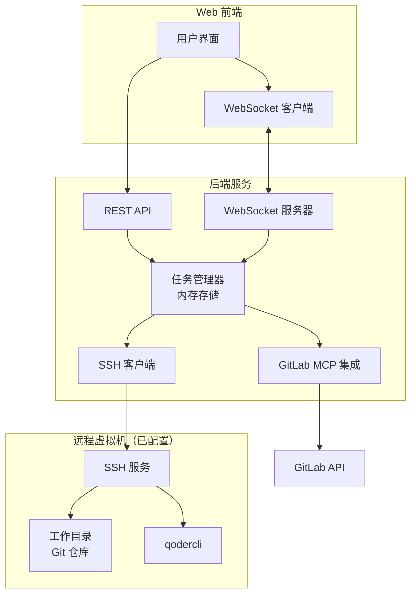
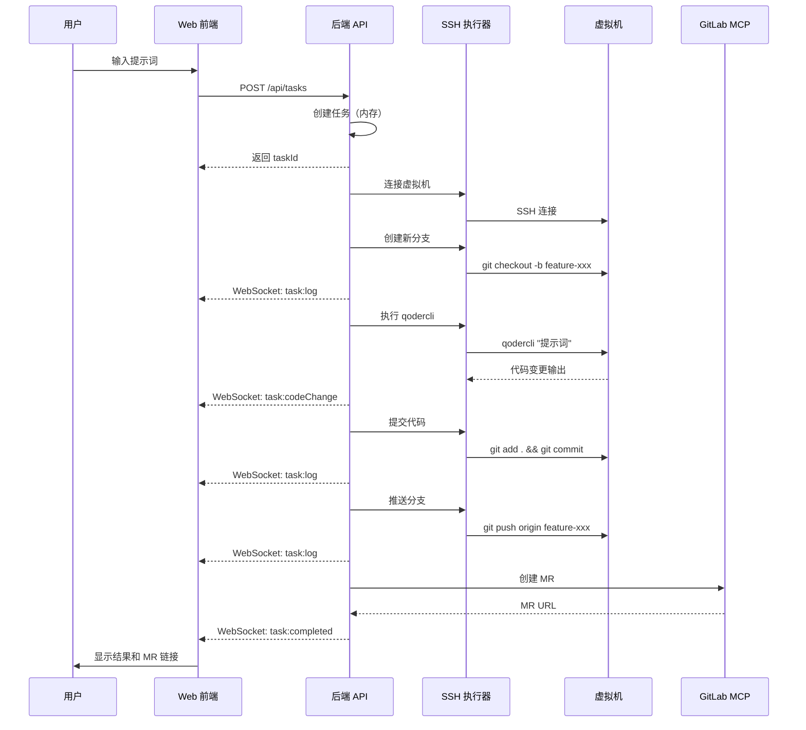

# Web 前端实习生助手系统 - 设计文档

## 概述

Web 前端实习生助手系统是一个基于 Web 的智能开发平台，旨在降低前端开发门槛。系统通过可视化界面接收用户的自然语言指令，在预配置的远程虚拟机上执行代码操作，并将结果实时反馈到 Web 端。核心特性包括：

- **零门槛操作**: 用户通过自然语言描述需求，无需了解命令行或配置开发环境
- **完整开发环境**: 远程虚拟机预装 Node.js、npm、构建工具等完整前端工具链
- **AI 代码修改**: 集成 qodercli，自动理解需求并修改代码
- **自动化工作流**: 通过 GitLab MCP 自动创建 Merge Request，简化代码审查流程

目标用户包括产品经理、后端工程师、测试工程师等非前端专业人员，帮助他们快速完成前端相关任务。

## 架构

### 系统架构图（MVP 版本）



### MVP 简化说明

**简化内容**:
- ❌ 不使用数据库，任务和日志存储在内存中（服务重启后丢失）
- ❌ 不考虑虚拟机管理，假设虚拟机已配置好（SSH 连接信息通过环境变量提供）
- ❌ 不实现连接池，使用单一 SSH 连接
- ❌ 不实现用户认证，单用户使用
- ❌ 不实现任务队列，串行执行

**保留核心功能**:
- ✅ Web 界面输入自然语言指令
- ✅ 通过 SSH 在虚拟机上执行命令
- ✅ 调用 qodercli 修改代码
- ✅ 实时推送执行日志到前端
- ✅ 展示代码变更 diff
- ✅ 通过 GitLab MCP 创建 Merge Request

### 架构层次

1. **表现层 (Presentation Layer)**
   - Web 前端界面：React 单页应用
   - 实时通信：WebSocket 连接
   - 状态管理：任务状态、执行日志、代码变更（前端内存）

2. **应用层 (Application Layer)**
   - REST API：任务创建、任务查询
   - WebSocket 服务：实时日志推送、状态更新
   - 任务管理器：任务执行协调、状态跟踪（后端内存）

3. **业务逻辑层 (Business Logic Layer)**
   - SSH 客户端：命令执行、输出捕获
   - AI 代码修改：qodercli 调用、输出解析
   - GitLab 集成：MR 创建

### 技术栈选择

**前端**:
- 框架: React 18+
- 状态管理: useState/useReducer (内置 hooks)
- UI 组件: Ant Design
- 代码高亮: react-diff-viewer
- HTTP 客户端: fetch API
- WebSocket: 原生 WebSocket API

**后端**:
- 运行时: Node.js 18+ LTS
- 框架: Express.js
- WebSocket: ws (轻量 WebSocket 库)
- SSH 客户端: ssh2
- 数据存储: 内存 Map/Array

**虚拟机环境（假设已配置）**:
- SSH 访问已开启
- Git 仓库已克隆
- qodercli 已安装
- Node.js 环境已就绪

## 组件和接口

### 核心组件（MVP 版本）

#### 1. Web 前端组件

**TaskInputPanel (任务输入面板)**
- 职责: 接收用户自然语言输入
- 接口:
  ```typescript
  interface TaskInputPanelProps {
    onSubmit: (prompt: string) => void;
    isLoading: boolean;
  }
  ```

**TaskExecutionView (任务执行视图)**
- 职责: 实时展示任务执行状态、日志输出
- 接口:
  ```typescript
  interface TaskExecutionViewProps {
    taskId: string;
    status: TaskStatus;
    logs: LogEntry[];
    codeChanges: CodeChange[];
  }
  ```

**CodeDiffViewer (代码对比查看器)**
- 职责: 展示代码变更的 diff 视图
- 接口:
  ```typescript
  interface CodeDiffViewerProps {
    changes: CodeChange[];
  }
  ```

#### 2. 后端服务组件

**TaskManager (任务管理器)**
- 职责: 任务生命周期管理、状态跟踪、执行协调（内存存储）
- 接口:
  ```typescript
  class TaskManager {
    private tasks: Map<string, Task>;
    private logs: Map<string, LogEntry[]>;
    
    createTask(prompt: string): Task;
    executeTask(taskId: string): Promise<void>;
    getTask(taskId: string): Task | undefined;
    getTasks(): Task[];
    addLog(taskId: string, log: LogEntry): void;
    getLogs(taskId: string): LogEntry[];
  }
  ```

**SSHExecutor (SSH 命令执行器)**
- 职责: 通过 SSH 在虚拟机上执行命令
- 接口:
  ```typescript
  class SSHExecutor {
    private connection: ssh2.Client;
    
    connect(config: SSHConfig): Promise<void>;
    executeCommand(command: string): Promise<CommandResult>;
    disconnect(): void;
  }
  
  interface SSHConfig {
    host: string;
    port: number;
    username: string;
    privateKey: string;
  }
  
  interface CommandResult {
    stdout: string;
    stderr: string;
    exitCode: number;
  }
  ```

**NeovateAIService (AI 代码修改服务)**
- 职责: 调用 qodercli，解析代码变更结果
- 接口:
  ```typescript
  class NeovateAIService {
    constructor(private sshExecutor: SSHExecutor);
    
    modifyCode(prompt: string, workDir: string): Promise<CodeChange[]>;
    private parseOutput(rawOutput: string): CodeChange[];
  }
  ```

**GitLabMCPService (GitLab MCP 集成服务)**
- 职责: 创建 Merge Request
- 接口:
  ```typescript
  class GitLabMCPService {
    createMergeRequest(params: MRParams): Promise<MergeRequest>;
  }
  
  interface MRParams {
    projectId: string;
    sourceBranch: string;
    targetBranch: string;
    title: string;
    description: string;
  }
  ```

### 数据模型（MVP 版本）

#### Task (任务)
```typescript
interface Task {
  id: string;
  prompt: string;              // 用户输入的自然语言指令
  status: TaskStatus;          // pending | running | success | failed
  branchName?: string;         // 工作分支名称（任务完成后生成）
  mrUrl?: string;              // Merge Request URL（创建后填充）
  createdAt: Date;
  completedAt?: Date;
  error?: string;
}

enum TaskStatus {
  PENDING = 'pending',
  RUNNING = 'running',
  SUCCESS = 'success',
  FAILED = 'failed'
}
```

#### LogEntry (日志条目)
```typescript
interface LogEntry {
  timestamp: Date;
  level: LogLevel;             // info | error
  source: string;              // 日志来源：ssh | neovateai | gitlab | system
  message: string;
}

enum LogLevel {
  INFO = 'info',
  ERROR = 'error'
}
```

#### CodeChange (代码变更)
```typescript
interface CodeChange {
  filePath: string;
  changeType: ChangeType;      // added | modified | deleted
  diff: string;                // unified diff 格式
}

enum ChangeType {
  ADDED = 'added',
  MODIFIED = 'modified',
  DELETED = 'deleted'
}
```

#### MergeRequest (合并请求)
```typescript
interface MergeRequest {
  mrId: number;                // GitLab MR ID
  webUrl: string;              // MR 页面 URL
  sourceBranch: string;
  targetBranch: string;
}
```

### API 接口设计（MVP 版本）

#### REST API

**任务管理**
```
POST   /api/tasks              创建并执行新任务
GET    /api/tasks              获取所有任务列表
GET    /api/tasks/:id          获取任务详情
GET    /api/tasks/:id/logs     获取任务日志
```

#### WebSocket 事件

**服务器 -> 客户端**
```
task:status         任务状态更新
  payload: { taskId: string, status: TaskStatus }

task:log            新日志条目
  payload: { taskId: string, log: LogEntry }

task:codeChange     代码变更通知
  payload: { taskId: string, changes: CodeChange[] }

task:completed      任务完成
  payload: { taskId: string, mrUrl?: string }

task:error          任务错误
  payload: { taskId: string, error: string }
```

## 核心工作流程

### 任务执行流程



## 正确性属性

*属性是指在系统所有有效执行过程中都应该保持为真的特征或行为——本质上是关于系统应该做什么的形式化陈述。属性是人类可读规范和机器可验证正确性保证之间的桥梁。*

### 属性反思

在分析验收标准后，我识别出以下可以合并或简化的属性：

**合并的属性**:
- AC-3.1 到 AC-3.5 (Git 操作) 可以合并为一个综合的 Git 操作属性
- AC-5.1 和 AC-5.2 (命令执行) 可以合并为通用的命令执行属性
- AC-6.1 到 AC-6.4 (可视化展示) 可以合并为渲染完整性属性

**冗余的属性**:
- AC-2.3 (执行命令) 被 AC-2.4 (捕获输出) 包含，因为捕获输出隐含了命令执行
- AC-4.3 (执行 qodercli) 被 AC-4.4 (解析输出) 包含
- AC-7.3 (推送代码) 被 AC-7.4 (创建 MR) 包含，因为创建 MR 需要先推送

### 核心属性

**属性 1: 任务状态转换的单调性**
*对于任意*任务，其状态转换必须遵循 pending → running → (success | failed) 的顺序，不能回退或跳跃
**验证需求: AC-8.3**

**属性 2: SSH 命令执行的完整性**
*对于任意*有效的 shell 命令，SSH 执行器应该能够捕获完整的 stdout 和 stderr，并返回正确的退出码
**验证需求: AC-2.3, AC-2.4**

**属性 3: Git 操作的原子性**
*对于任意*Git 操作序列（创建分支、提交、推送），如果任何步骤失败，系统应该能够检测到错误并报告，不会留下不一致的状态
**验证需求: AC-3.1, AC-3.2, AC-3.4, AC-3.5**

**属性 4: qodercli 输出解析的鲁棒性**
*对于任意*qodercli 的输出（包括成功和失败情况），解析器应该能够提取代码变更信息或错误信息，不会崩溃
**验证需求: AC-4.4**

**属性 5: 任务日志的时序性**
*对于任意*任务，其日志条目的时间戳应该是单调递增的，反映事件的真实发生顺序
**验证需求: AC-1.4, AC-8.5**

**属性 6: WebSocket 消息的可靠传递**
*对于任意*任务状态变更或日志条目，如果 WebSocket 连接正常，相应的消息应该在合理时间内（< 1秒）推送到前端
**验证需求: AC-1.2, AC-4.5**

**属性 7: 代码变更 diff 的完整性**
*对于任意*代码变更，生成的 diff 应该包含文件路径、变更类型和具体的差异内容
**验证需求: AC-6.2**

**属性 8: MR 创建的幂等性**
*对于任意*已完成的任务，多次尝试创建 MR 应该返回相同的 MR（通过分支名称去重），而不是创建重复的 MR
**验证需求: AC-7.4**

**属性 9: 任务-分支的一对一映射**
*对于任意*任务，应该有且仅有一个唯一的分支名称与之关联，不同任务的分支名称不应重复
**验证需求: AC-8.2**

**属性 10: 历史记录的持久性**
*对于任意*已完成的任务，其基本信息（ID、提示词、状态、完成时间）应该能够从历史记录中检索到
**验证需求: AC-1.4, AC-8.5**

### 边界情况属性

**属性 11: 空输入处理**
*对于*空字符串或纯空白字符的提示词，系统应该拒绝创建任务并返回明确的错误信息
**验证需求: AC-1.1**

**属性 12: SSH 连接失败的优雅降级**
*当*SSH 连接失败时，系统应该将任务标记为失败，记录错误日志，并通知前端，而不是崩溃
**验证需求: AC-2.1, AC-2.5**

**属性 13: 超长命令输出的截断**
*对于*输出超过 10MB 的命令，系统应该截断输出并添加截断标记，防止内存溢出
**验证需求: AC-2.4**

## 错误处理

### 错误分类

1. **网络错误**
   - SSH 连接失败
   - GitLab API 调用失败
   - WebSocket 连接断开

2. **命令执行错误**
   - Shell 命令返回非零退出码
   - qodercli 执行失败
   - Git 操作失败（如合并冲突）

3. **数据验证错误**
   - 无效的任务输入
   - 无效的 SSH 配置
   - 无效的 GitLab 配置

4. **系统错误**
   - 内存不足
   - 文件系统错误
   - 未预期的异常

### 错误处理策略

**SSH 连接错误**:
```typescript
try {
  await sshExecutor.connect(config);
} catch (error) {
  taskManager.updateTaskStatus(taskId, TaskStatus.FAILED);
  taskManager.addLog(taskId, {
    timestamp: new Date(),
    level: LogLevel.ERROR,
    source: 'ssh',
    message: `SSH 连接失败: ${error.message}`
  });
  // 通过 WebSocket 通知前端
  wsServer.broadcast('task:error', {
    taskId,
    error: 'SSH 连接失败，请检查虚拟机状态'
  });
}
```

**命令执行错误**:
```typescript
const result = await sshExecutor.executeCommand(command);
if (result.exitCode !== 0) {
  taskManager.addLog(taskId, {
    timestamp: new Date(),
    level: LogLevel.ERROR,
    source: 'ssh',
    message: `命令执行失败 (退出码 ${result.exitCode}): ${result.stderr}`
  });
  // 继续执行或终止任务，取决于错误严重程度
}
```

**GitLab API 错误**:
```typescript
try {
  const mr = await gitlabService.createMergeRequest(params);
  return mr;
} catch (error) {
  if (error.statusCode === 409) {
    // MR 已存在，查询现有 MR
    return await gitlabService.findExistingMR(params.sourceBranch);
  }
  throw error; // 其他错误向上传播
}
```

**输入验证**:
```typescript
function validateTaskInput(prompt: string): void {
  if (!prompt || prompt.trim().length === 0) {
    throw new ValidationError('提示词不能为空');
  }
  if (prompt.length > 5000) {
    throw new ValidationError('提示词长度不能超过 5000 字符');
  }
}
```

### 错误恢复机制

1. **自动重试**: SSH 连接失败时，最多重试 3 次，每次间隔 2 秒
2. **状态回滚**: 如果任务执行过程中失败，确保任务状态正确标记为 FAILED
3. **日志记录**: 所有错误都记录详细日志，包括堆栈跟踪（仅服务器端）
4. **用户通知**: 通过 WebSocket 实时通知前端错误信息，提供可操作的建议

## 测试策略

### 双重测试方法

本系统采用**单元测试**和**基于属性的测试**相结合的方法，以确保全面的代码覆盖和正确性验证。

- **单元测试**验证特定示例、边界情况和错误条件
- **基于属性的测试**验证应该在所有输入上成立的通用属性
- 两者互补：单元测试捕获具体的 bug，基于属性的测试验证通用正确性

### 单元测试

**测试框架**: Jest

**测试范围**:
- API 端点的基本功能（创建任务、查询任务）
- SSH 连接和命令执行的成功/失败场景
- WebSocket 消息的发送和接收
- 错误处理和边界情况

**示例单元测试**:
```typescript
describe('TaskManager', () => {
  test('创建任务应该生成唯一 ID', () => {
    const manager = new TaskManager();
    const task1 = manager.createTask('提示词 1');
    const task2 = manager.createTask('提示词 2');
    expect(task1.id).not.toBe(task2.id);
  });

  test('空提示词应该抛出错误', () => {
    const manager = new TaskManager();
    expect(() => manager.createTask('')).toThrow('提示词不能为空');
  });
});
```

### 基于属性的测试

**测试框架**: fast-check (JavaScript/TypeScript 的属性测试库)

**配置要求**:
- 每个属性测试至少运行 100 次迭代
- 每个测试必须用注释明确引用设计文档中的正确性属性
- 标签格式: `// Feature: web-frontend-intern-assistant, Property X: [属性描述]`

**属性测试示例**:

```typescript
import fc from 'fast-check';

describe('Property-Based Tests', () => {
  // Feature: web-frontend-intern-assistant, Property 1: 任务状态转换的单调性
  test('任务状态应该单调递增', () => {
    fc.assert(
      fc.property(fc.string(), (prompt) => {
        const manager = new TaskManager();
        const task = manager.createTask(prompt);
        
        expect(task.status).toBe(TaskStatus.PENDING);
        
        manager.updateTaskStatus(task.id, TaskStatus.RUNNING);
        const runningTask = manager.getTask(task.id);
        expect(runningTask?.status).toBe(TaskStatus.RUNNING);
        
        // 不能从 RUNNING 回退到 PENDING
        expect(() => 
          manager.updateTaskStatus(task.id, TaskStatus.PENDING)
        ).toThrow();
      }),
      { numRuns: 100 }
    );
  });

  // Feature: web-frontend-intern-assistant, Property 5: 任务日志的时序性
  test('日志时间戳应该单调递增', () => {
    fc.assert(
      fc.property(
        fc.string(),
        fc.array(fc.string(), { minLength: 2, maxLength: 10 }),
        (taskPrompt, logMessages) => {
          const manager = new TaskManager();
          const task = manager.createTask(taskPrompt);
          
          logMessages.forEach(msg => {
            manager.addLog(task.id, {
              timestamp: new Date(),
              level: LogLevel.INFO,
              source: 'test',
              message: msg
            });
          });
          
          const logs = manager.getLogs(task.id);
          for (let i = 1; i < logs.length; i++) {
            expect(logs[i].timestamp.getTime())
              .toBeGreaterThanOrEqual(logs[i-1].timestamp.getTime());
          }
        }
      ),
      { numRuns: 100 }
    );
  });

  // Feature: web-frontend-intern-assistant, Property 9: 任务-分支的一对一映射
  test('不同任务应该有不同的分支名称', () => {
    fc.assert(
      fc.property(
        fc.array(fc.string({ minLength: 1 }), { minLength: 2, maxLength: 20 }),
        (prompts) => {
          const manager = new TaskManager();
          const tasks = prompts.map(p => manager.createTask(p));
          const branchNames = tasks.map(t => t.branchName);
          
          // 所有分支名称应该唯一
          const uniqueBranches = new Set(branchNames);
          expect(uniqueBranches.size).toBe(branchNames.length);
        }
      ),
      { numRuns: 100 }
    );
  });
});
```

### 集成测试

**测试范围**:
- 完整的任务执行流程（从创建到完成）
- WebSocket 实时通信
- SSH 连接和命令执行（使用测试虚拟机）

**测试环境**:
- 使用 Docker 容器模拟虚拟机环境
- 使用 GitLab 测试实例或 mock GitLab API

### 测试覆盖率目标

- 单元测试覆盖率: > 80%
- 关键路径（任务执行流程）覆盖率: 100%
- 所有正确性属性都有对应的属性测试

