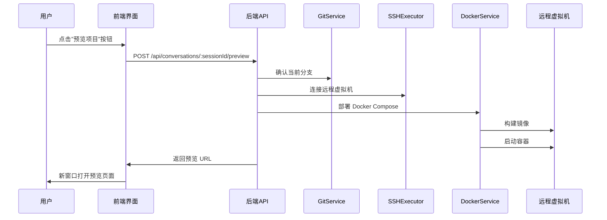
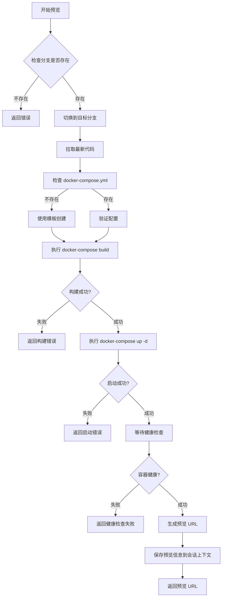

# 项目预览功能设计文档

## 功能概述

在 Web 端对话界面中添加"预览项目"功能，用户点击后触发将当前对话分支的代码通过 Docker Compose 部署至远程虚拟主机，完成后在浏览器新窗口中打开预览页面。

## 功能目标

- 用户能够在对话过程中一键预览当前分支的代码效果
- 自动化完成代码部署、Docker 容器启动、端口映射
- 在浏览器新窗口打开预览页面
- 提供部署状态实时反馈
- 支持多个对话分支的独立预览环境

## 业务流程

### 预览触发流程



### 部署流程



## 核心数据结构

### 预览请求参数

| 字段名 | 类型 | 必填 | 说明 |
|--------|------|------|------|
| sessionId | string | 是 | 对话会话 ID |
| branchId | string | 否 | 分支 ID，默认使用当前分支 |
| forceRebuild | boolean | 否 | 是否强制重新构建，默认 false |

### 预览响应数据

| 字段名 | 类型 | 说明 |
|--------|------|------|
| success | boolean | 是否成功 |
| previewUrl | string | 预览访问地址 |
| containerId | string | 容器 ID |
| deploymentInfo | object | 部署信息 |
| deploymentInfo.buildTime | number | 构建耗时（秒） |
| deploymentInfo.startTime | number | 启动耗时（秒） |
| deploymentInfo.totalTime | number | 总耗时（秒） |
| deploymentInfo.ports | array | 端口映射信息 |
| error | string | 错误信息（失败时） |

### 会话上下文扩展

在 ConversationContext 中新增预览相关字段：

| 字段名 | 类型 | 说明 |
|--------|------|------|
| previewInfo | object | 预览信息 |
| previewInfo.url | string | 当前预览 URL |
| previewInfo.containerId | string | 容器 ID |
| previewInfo.branchName | string | Git 分支名 |
| previewInfo.deployedAt | Date | 部署时间 |
| previewInfo.status | string | 预览状态：building/running/stopped/error |

## 接口设计

### 创建预览部署

**端点**: `POST /api/conversations/:sessionId/preview`

**请求参数**:
```json
{
  "branchId": "可选，默认当前分支",
  "forceRebuild": false
}
```

**响应示例**:
```json
{
  "success": true,
  "data": {
    "previewUrl": "http://192.168.1.100:8080",
    "containerId": "abc123def456",
    "deploymentInfo": {
      "buildTime": 45,
      "startTime": 3,
      "totalTime": 48,
      "ports": [
        { "host": 8080, "container": 80, "service": "basement" },
        { "host": 8083, "container": 8083, "service": "sub-app" }
      ]
    }
  }
}
```

### 获取预览状态

**端点**: `GET /api/conversations/:sessionId/preview/status`

**响应示例**:
```json
{
  "success": true,
  "data": {
    "status": "running",
    "url": "http://192.168.1.100:8080",
    "containerId": "abc123def456",
    "branchName": "conversation-a1b2c3d4-1234567890",
    "deployedAt": "2025-12-11T10:30:00Z",
    "healthCheck": {
      "healthy": true,
      "lastCheck": "2025-12-11T11:00:00Z"
    }
  }
}
```

### 停止预览

**端点**: `DELETE /api/conversations/:sessionId/preview`

**响应示例**:
```json
{
  "success": true,
  "message": "预览已停止"
}
```

## 服务层设计

### ProjectPreviewService

**职责**: 统筹预览部署流程

**核心方法**:

| 方法名 | 参数 | 返回值 | 说明 |
|--------|------|--------|------|
| createPreview | sessionId, branchId?, forceRebuild? | PreviewResult | 创建预览部署 |
| getPreviewStatus | sessionId | PreviewStatus | 获取预览状态 |
| stopPreview | sessionId | OperationResult | 停止预览 |
| checkContainerHealth | containerId | HealthCheckResult | 检查容器健康状态 |
| generatePreviewUrl | hostIp, ports | string | 生成预览访问地址 |

**创建预览流程**:
1. 从 ConversationManager 获取会话上下文
2. 获取当前 Git 分支名称
3. 通过 GitService 确认分支存在并切换
4. 验证 docker-compose.yml 存在
5. 通过 DockerComposeService 执行部署
6. 等待容器启动并进行健康检查
7. 生成预览 URL
8. 更新会话上下文中的预览信息
9. 返回预览结果

### 与现有服务的集成

**集成点**:

| 现有服务 | 调用关系 | 用途 |
|----------|----------|------|
| ConversationManager | 读取会话信息，更新预览状态 | 获取项目路径、分支信息 |
| GitService | 调用分支操作方法 | 切换分支、确认代码状态 |
| DockerComposeService | 调用部署方法 | 构建和启动容器 |
| SSHExecutor | 通过 DockerComposeService 间接使用 | 远程命令执行 |

## 前端界面设计

### 按钮位置

在对话界面顶部 Header 区域添加"预览项目"按钮，位于 Git 分支和 MR 链接之后。

**显示条件**:
- 仅在编辑模式（edit）下显示
- 必须存在有效的 Git 分支

### 按钮状态

| 状态 | 图标 | 文案 | 样式 | 交互 |
|------|------|------|------|------|
| 空闲 | 🚀 | 预览项目 | 蓝色按钮 | 可点击 |
| 部署中 | 加载动画 | 部署中... | 禁用状态 | 不可点击 |
| 已部署 | ✓ | 查看预览 | 绿色按钮 | 点击打开新窗口 |
| 部署失败 | ⚠️ | 重新部署 | 橙色按钮 | 可点击重试 |

### 部署进度提示

使用 Ant Design 的 Message 组件展示部署进度：

**阶段反馈**:
1. 开始部署：显示 Loading 消息"正在部署..."
2. 构建中：更新消息"正在构建镜像..."
3. 启动中：更新消息"正在启动容器..."
4. 健康检查：更新消息"检查服务健康状态..."
5. 完成：显示 Success 消息"部署成功！"并自动打开新窗口
6. 失败：显示 Error 消息，展示具体错误信息

### 预览信息展示

在对话界面 Header 中，已部署状态下展示预览信息：

**展示内容**:
- 预览地址（可点击）
- 部署时间（相对时间）
- 容器状态指示器（绿点表示运行中）
- 停止预览按钮（小型按钮）

## 端口分配策略

### 动态端口分配

为避免多个对话分支的容器端口冲突，采用动态端口分配策略：

**分配规则**:
- 基础端口范围：8080-8180（basement 应用）
- 子应用端口范围：8183-8283（sub-app）
- 每个会话分配连续端口段

**分配方法**:
1. 查询当前已占用端口列表
2. 从基础端口开始查找可用端口
3. 为每个服务分配连续端口
4. 记录端口分配信息到会话上下文

### 端口映射表

| 服务名称 | 容器端口 | 主机端口 | 说明 |
|----------|----------|----------|------|
| basement | 80 | 动态分配（8080-8180） | 基座应用 |
| sub-app | 8083 | 动态分配（8183-8283） | 子应用 |

## 资源管理

### 容器生命周期管理

**清理策略**:
- 会话完成或失败时，自动停止并删除容器
- 用户主动停止预览时，停止并删除容器
- 新预览部署时，自动停止旧容器

**容器标签**:
为容器添加标签便于管理：
- `conversation.session-id`: 会话 ID
- `conversation.branch`: Git 分支名
- `conversation.created-at`: 创建时间

### 并发控制

**限制规则**:
- 每个会话同时只能有一个活跃预览
- 新预览请求会自动替换旧预览

## 错误处理

### 错误类型及处理

| 错误类型 | 原因 | 处理方式 |
|----------|------|----------|
| 分支不存在 | 指定的 Git 分支不存在 | 返回错误提示，建议用户检查分支 |
| 配置文件缺失 | 项目中无 docker-compose.yml | 使用默认模板创建 |
| 构建失败 | Docker 镜像构建失败 | 返回构建日志，显示具体错误 |
| 端口冲突 | 分配的端口已被占用 | 自动重新分配可用端口 |
| 启动超时 | 容器启动超过 120 秒 | 停止部署，返回超时错误 |
| 健康检查失败 | 服务无法正常响应 | 返回健康检查详情 |
| SSH 连接失败 | 无法连接远程虚拟机 | 返回连接错误，建议检查网络 |

### 超时设置

| 操作 | 超时时间 | 说明 |
|------|----------|------|
| 镜像构建 | 300 秒 | 首次构建可能较慢 |
| 容器启动 | 120 秒 | 等待容器进入运行状态 |
| 健康检查 | 30 秒 | 检查服务可访问性 |
| 总体超时 | 600 秒 | 整个部署流程的最大时间 |

## 安全考虑

### 访问控制

**验证机制**:
- 预览请求需验证 sessionId 的有效性
- 确认请求用户有权限操作该会话
- 预览 URL 仅限内网访问

### 资源隔离

**隔离措施**:
- 每个会话使用独立的容器
- 容器间网络隔离
- 限制容器资源使用（CPU、内存）

### 敏感信息保护

**保护措施**:
- 不在预览 URL 中包含敏感信息
- 容器日志不输出环境变量
- 定期清理停止的容器

## 性能优化

### 构建缓存

**优化策略**:
- 利用 Docker 层缓存加速构建
- 使用 pnpm store 缓存依赖
- 多阶段构建减少镜像体积

### 并行处理

**并行任务**:
- 构建多个服务时并行执行
- 健康检查并行检测多个端口

### 资源限制

**容器资源约束**:
- 单个容器最大 CPU：2 核
- 单个容器最大内存：2GB
- 防止资源耗尽影响其他服务

## 监控与日志

### 部署日志记录

**记录内容**:
- 部署开始时间
- 每个阶段的耗时
- 构建和启动的输出日志
- 部署结果（成功/失败）

**日志级别**:
- INFO: 正常流程节点
- WARN: 非关键错误（如端口冲突自动重试）
- ERROR: 部署失败原因

### 状态监控

**监控指标**:
- 容器运行状态
- 端口占用情况
- 资源使用率
- 健康检查结果

## 实现优先级

### 第一阶段：基础功能

- 实现 ProjectPreviewService 核心逻辑
- 添加预览部署接口
- 前端添加预览按钮和基础交互
- 实现固定端口的预览部署

### 第二阶段：增强体验

- 实现动态端口分配
- 添加部署进度实时反馈
- 实现容器健康检查
- 添加预览状态展示

### 第三阶段：完善优化

- 实现资源自动清理
- 添加并发控制
- 优化构建缓存策略
- 完善错误处理和日志

## 技术依赖

### 现有依赖

- dockerode: Docker 操作库
- ssh2: SSH 连接库
- express: Web 框架

### 新增依赖

无需新增外部依赖，充分利用现有技术栈。

## 配置项

### 环境变量扩展

| 变量名 | 说明 | 默认值 |
|--------|------|--------|
| PREVIEW_PORT_RANGE_START | 预览端口起始 | 8080 |
| PREVIEW_PORT_RANGE_END | 预览端口结束 | 8280 |
| PREVIEW_CONTAINER_CPU_LIMIT | 容器 CPU 限制 | 2 |
| PREVIEW_CONTAINER_MEMORY_LIMIT | 容器内存限制 | 2g |
| PREVIEW_BUILD_TIMEOUT | 构建超时（秒） | 300 |
| PREVIEW_STARTUP_TIMEOUT | 启动超时（秒） | 120 |
| PREVIEW_HEALTH_CHECK_TIMEOUT | 健康检查超时（秒） | 30 |

## 测试策略

### 单元测试

**测试范围**:
- ProjectPreviewService 各方法
- 端口分配逻辑
- URL 生成逻辑
- 错误处理逻辑

### 集成测试

**测试场景**:
- 完整预览部署流程
- 多会话并发预览
- 容器自动清理
- 端口冲突处理

### 手动测试

**测试用例**:
- 首次预览部署
- 重复预览部署
- 强制重新构建
- 网络异常情况
- 停止预览功能
