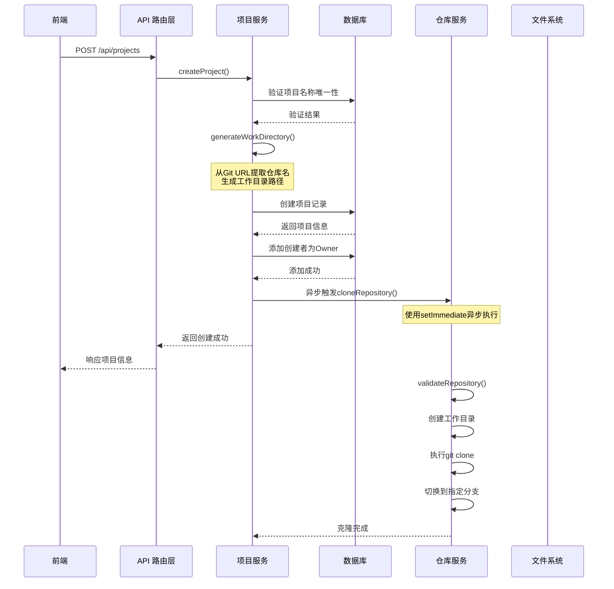
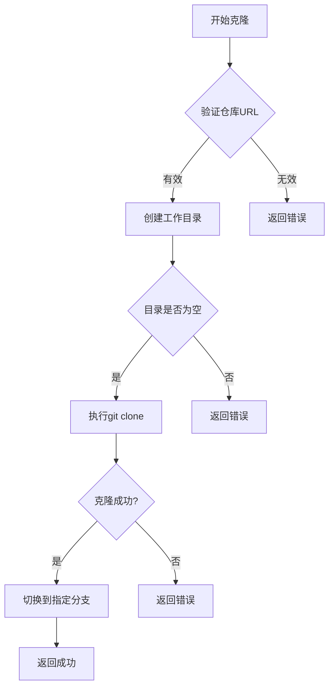
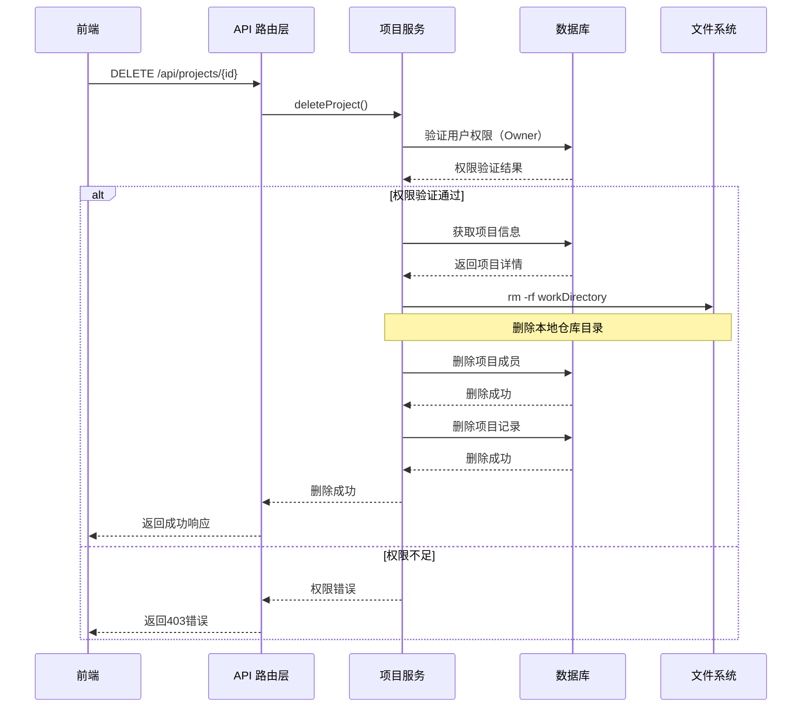

# 项目管理功能总结文档

## 一、功能概述

项目管理功能是 Web 前端实习生助手系统的核心模块之一，提供了完整的项目生命周期管理能力，包括项目创建、仓库自动克隆、项目查询、项目更新和项目删除等功能。

### 核心特性
- **项目创建**：支持配置 GitLab 仓库地址、项目名称和描述
- **自动克隆**：项目创建成功后自动在后台触发 Git 仓库克隆
- **权限管理**：基于角色的项目成员权限控制（Owner/Admin/Member）
- **仓库管理**：自动管理本地仓库目录的创建和删除
- **GitLab 集成**：支持私有 GitLab 实例集成

## 二、系统架构

### 2.1 技术栈
- **后端**：Node.js + Express.js + TypeScript
- **数据库**：PostgreSQL (Supabase) + Drizzle ORM
- **前端**：React + Ant Design
- **Git 操作**：原生 Git 命令行工具

### 2.2 模块结构
```
backend/src/
├── api/
│   └── projectRoutes.ts      # 项目相关 API 路由
├── services/
│   ├── ProjectService.ts     # 项目业务逻辑核心
│   └── RepositoryService.ts  # 仓库克隆和管理
├── db/
│   └── schema.ts             # 数据库表结构定义
└── types/
    └── index.ts              # TypeScript 类型定义
```

## 三、数据模型

### 3.1 数据库表结构

#### projects 表
| 字段名 | 类型 | 说明 |
|--------|------|------|
| id | uuid | 项目唯一标识 |
| name | varchar(255) | 项目名称 |
| description | text | 项目描述 |
| repo_dir | text | 仓库目录路径 |
| git_branch | varchar(100) | Git 分支名（默认 master） |
| is_active | boolean | 项目是否激活 |
| created_by | uuid | 创建者用户ID |
| git_repository_url | varchar(500) | Git 仓库 URL |
| gitlab_project_id | varchar(100) | GitLab 项目 ID |
| gitlab_url | varchar(500) | GitLab 实例 URL |
| work_directory | varchar(500) | 工作目录绝对路径 |
| owner_id | uuid | 项目所有者 ID |
| created_at | timestamp | 创建时间 |
| updated_at | timestamp | 更新时间 |

#### project_members 表
| 字段名 | 类型 | 说明 |
|--------|------|------|
| id | uuid | 成员关系唯一标识 |
| project_id | uuid | 项目 ID |
| user_id | uuid | 用户 ID |
| role | varchar(50) | 成员角色（owner/admin/member） |
| created_at | timestamp | 创建时间 |

### 3.2 角色权限体系
- **Owner（所有者）**：所有权限，包括删除项目、管理成员
- **Admin（管理员）**：可以修改项目信息、管理成员（除 Owner）
- **Member（成员）**：只能查看项目、创建对话

## 四、接口设计

### 4.1 项目管理接口

#### 创建项目
```
POST /api/projects
Headers:
  - Content-Type: application/json
  - X-User-Id: {userId}

Request Body:
{
  "name": "项目名称",
  "description": "项目描述（可选）",
  "gitRepositoryUrl": "https://git.dtminds.cn/front-end/uni-mall-dy",
  "gitlab": {
    "projectId": "532",
    "url": "https://git.dtminds.cn"
  }
}

Response:
{
  "success": true,
  "data": {
    "id": "项目ID",
    "name": "项目名称",
    "workDirectory": "工作目录路径",
    // ... 其他项目信息
  },
  "message": "项目创建成功"
}
```

#### 获取项目列表
```
GET /api/projects?isActive=true&search=关键词
Headers:
  - X-User-Id: {userId}

Response:
{
  "success": true,
  "data": [项目列表],
  "total": 项目总数,
  "message": "获取项目列表成功"
}
```

#### 获取项目详情
```
GET /api/projects/{projectId}
Headers:
  - X-User-Id: {userId}

Response:
{
  "success": true,
  "data": 项目详细信息,
  "message": "获取项目详情成功"
}
```

#### 更新项目
```
PUT /api/projects/{projectId}
Headers:
  - X-User-Id: {userId}

Request Body:
{
  "name": "新项目名称",
  "description": "新项目描述",
  // ... 其他可更新字段
}

Response:
{
  "success": true,
  "data": 更新后的项目信息,
  "message": "项目更新成功"
}
```

#### 删除项目
```
DELETE /api/projects/{projectId}
Headers:
  - X-User-Id: {userId}

Response:
{
  "success": true,
  "message": "项目删除成功"
}
```

### 4.2 成员管理接口

#### 获取成员列表
```
GET /api/projects/{projectId}/members
Headers:
  - X-User-Id: {userId}

Response:
{
  "success": true,
  "data": [成员列表],
  "message": "获取成员列表成功"
}
```

#### 添加成员
```
POST /api/projects/{projectId}/members
Headers:
  - X-User-Id: {userId}

Request Body:
{
  "userId": "用户ID",
  "role": "admin" // owner/admin/member
}

Response:
{
  "success": true,
  "message": "成员添加成功"
}
```

#### 移除成员
```
DELETE /api/projects/{projectId}/members/{userId}
Headers:
  - X-User-Id: {userId}

Response:
{
  "success": true,
  "message": "成员移除成功"
}
```

## 五、核心业务流程

### 5.1 项目创建流程



### 5.2 仓库克隆流程



### 5.3 项目删除流程



## 六、数据流转详解

### 6.1 项目创建数据流

1. **请求接收**
   - 前端发送 POST 请求到 `/api/projects`
   - 携带用户认证头 `X-User-Id`

2. **数据验证**
   ```typescript
   // 验证必填字段
   if (!data.name || !data.gitRepositoryUrl) {
     return { success: false, error: '必填字段缺失' };
   }
   
   // 验证项目名称唯一性
   const existing = await db.select()
     .from(projects)
     .where(and(
       eq(projects.name, data.name),
       eq(projects.ownerId, userId)
     ));
   ```

3. **工作目录生成**
   ```typescript
   private generateWorkDirectory(name: string, gitUrl: string): string {
     // 从 Git URL 提取仓库名
     const repoName = gitUrl.split('/').pop();
     // 清理特殊字符
     const sanitizedName = repoName.replace(/[^a-z0-9\-]/g, '');
     // 拼接基础路径
     return `${baseWorkDir}/${sanitizedName}`;
   }
   ```

4. **数据库操作**
   ```sql
   -- 插入项目记录
   INSERT INTO projects (
     id, name, description, repo_dir, git_branch,
     git_repository_url, work_directory, owner_id, created_by
   ) VALUES (...);
   
   -- 添加项目所有者
   INSERT INTO project_members (id, project_id, user_id, role)
   VALUES (...);
   ```

5. **异步克隆**
   ```typescript
   // 异步触发，不阻塞响应
   setImmediate(async () => {
     const result = await repositoryService.cloneRepository(project);
     if (result.success) {
       console.log('✅ 仓库克隆成功');
     }
   });
   ```

### 6.2 仓库克隆数据流

1. **URL 验证**
   ```typescript
   // 验证 URL 格式
   const urlPattern = /^https?:\/\/.+|git@.+:.+\.git$/;
   
   // 验证域名白名单
   const allowedDomains = ['github.com', 'gitlab.com', 'git.dtminds.cn'];
   
   // 测试仓库可访问性
   await executor.executeCommand(`git ls-remote ${url}`);
   ```

2. **目录操作**
   ```bash
   # 创建目录
   mkdir -p /path/to/work/directory
   
   # 检查目录是否为空
   ls -A /path/to/work/directory
   ```

3. **Git 克隆**
   ```bash
   # 浅克隆指定分支
   git clone --depth 1 --branch master <url> <work-dir>
   
   # 验证克隆结果
   git rev-parse --git-dir
   git rev-parse --abbrev-ref HEAD
   ```

### 6.3 项目删除数据流

1. **权限验证**
   ```typescript
   // 验证是否为项目所有者
   const permission = await this.checkPermission(
     projectId, userId, MemberRole.OWNER
   );
   ```

2. **文件系统清理**
   ```bash
   # 递归删除目录
   rm -rf "/path/to/work/directory"
   ```

3. **数据库清理**
   ```sql
   -- 删除项目成员
   DELETE FROM project_members WHERE project_id = ?;
   
   -- 删除项目记录
   DELETE FROM projects WHERE id = ?;
   ```

## 七、配置管理

### 7.1 环境变量配置

```bash
# 运行模式
RUN_MODE=local

# 工作目录配置
LOCAL_GIT_WORK_DIR=/Users/gangqiang/Desktop/front-intern/front-workspace

# GitLab 配置
GITLAB_URL=https://git.dtminds.cn/
GITLAB_TOKEN=your-token
```

### 7.2 关键配置说明

- **LOCAL_GIT_WORK_DIR**：本地仓库的根目录，所有项目仓库都将克隆在此目录下
- **RUN_MODE**：运行模式，local 表示本地执行，remote 表示远程虚拟机执行
- **GitLab 配置**：用于集成私有 GitLab 实例

## 八、错误处理

### 8.1 常见错误类型

1. **权限错误**
   - 非项目所有者尝试删除项目
   - 非管理员尝试修改项目信息

2. **验证错误**
   - 项目名称重复
   - Git URL 格式错误
   - Git 仓库无法访问

3. **系统错误**
   - 工作目录创建失败
   - Git 克隆失败
   - 数据库操作失败

### 8.2 错误响应格式

```json
{
  "success": false,
  "error": "错误描述信息",
  "message": "用户友好的错误提示"
}
```

## 九、性能优化

### 9.1 异步处理
- 仓库克隆使用 `setImmediate` 异步执行，不阻塞 API 响应
- 克隆进度通过回调函数实时反馈

### 9.2 浅克隆优化
- 使用 `--depth 1` 进行浅克隆，减少下载时间
- 只克隆指定分支，减少数据传输

### 9.3 数据库优化
- 为常用查询字段添加索引
- 使用连接池管理数据库连接

## 十、安全考虑

### 10.1 权限控制
- 所有操作都需要用户认证
- 基于角色的细粒度权限控制
- 项目所有者拥有最高权限

### 10.2 路径安全
- 工作目录路径基于配置的基础路径
- 防止路径遍历攻击
- 仓库名称经过安全过滤

### 10.3 Git 安全
- Git URL 域名白名单验证
- 使用 HTTPS 协议确保传输安全

## 十一、监控与日志

### 11.1 关键日志点
- 项目创建/删除操作
- 仓库克隆进度和结果
- 权限验证失败
- 系统错误和异常

### 11.2 日志格式示例
```
[ProjectService] 开始为项目 {projectId} 克隆仓库
[ProjectService] 仓库URL: {gitUrl}
[ProjectService] 工作目录: {workDir}
[ProjectService] 克隆进度 [cloning]: 正在下载仓库文件... (31%)
[ProjectService] ✅ 项目 {projectId} 仓库克隆完成
```

## 十二、测试策略

### 12.1 单元测试
- ProjectService 各方法测试
- RepositoryService 克隆逻辑测试
- 权限验证逻辑测试

### 12.2 集成测试
- 完整的项目创建流程测试
- 仓库克隆端到端测试
- 权限控制集成测试

### 12.3 测试用例示例
```typescript
describe('ProjectService', () => {
  it('should create project and clone repository', async () => {
    const result = await projectService.createProject(data, userId);
    expect(result.success).toBe(true);
    
    // 验证仓库是否被克隆
    const exists = fs.existsSync(result.project.workDirectory);
    expect(exists).toBe(true);
  });
});
```

## 十三、未来扩展

### 13.1 可能的增强功能
- 支持多个 Git 仓库关联
- 项目模板功能
- 仓库自动更新机制
- 更细粒度的权限控制

### 13.2 技术优化方向
- 使用 Git 库替代命令行调用
- 实现仓库克隆进度实时推送
- 添加项目统计和分析功能
- 支持批量操作

## 十四、总结

项目管理功能通过完善的架构设计和实现，提供了稳定可靠的项目管理能力。核心特性包括：

1. **完整的项目生命周期管理**：从创建到删除的全流程支持
2. **自动化的仓库管理**：创建时自动克隆，删除时自动清理
3. **灵活的权限控制**：基于角色的多级权限体系
4. **良好的扩展性**：模块化设计便于功能扩展

该功能已通过充分测试，能够满足实际生产环境的使用需求。